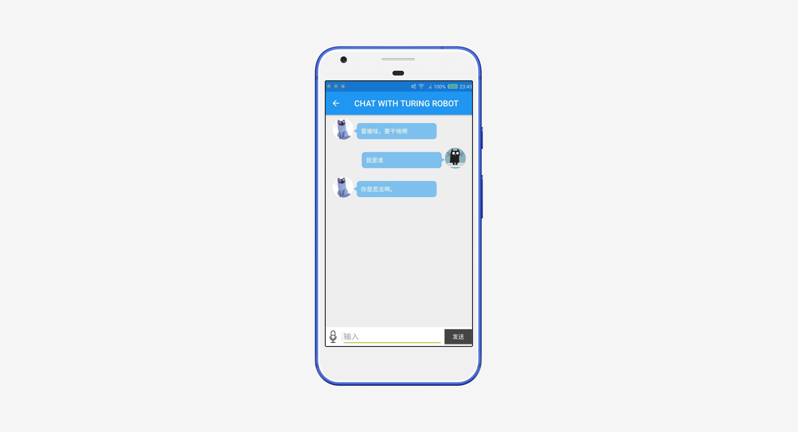

# Just a Cat — An Information Application


## 1. Introduction

*Just a Cat*  is an informative Android application. It integrates latest news from *The New York Times*, *The Guardian* and some mainstream medias in China, weather information, projects on github trending, a turing robot which can chat with users (support voice input) and translation (support voice input).


## 2. APIs

[The Guardian](http://content.guardianapis.com/)

> *The Guardian* is a British daily newspaper which is focus on reporting international news. It is good at making comments and analytical thematic articles. The paper's readership is generally on the mainstream left of British political opinion.

[The New York Times](https://api.nytimes.com/) (need to use proxy)

> *The New York Times* is an American newspaper based in New York City with worldwide influence and readership. It has long been regarded within the industry as a national "newspaper of record".

[Integration of some mainstream medias in China (Tencent, CCTV, World Wide)](http://120.79.65.201:80/Android/Hot)  (unofficial)

> All of them are large Chinese news websites.

[Turing Robot](http://openapi.tuling123.com/)

> An open intelligence chat robot platform which provide APIs for users to chat with turing robot.

[Weather](http://guolin.tech/api/weather)  (unofficial)

> Provide the weather information of every province, including  weather forecast, air quality and life advice.

[Bing pictures (background picture of weather page)](http://guolin.tech/api/bing_pic)  (unofficial)

> Update a beautiful picture everyday.

[Youdao Translator](http://openapi.youdao.com/api)

> A Translator.

Speech recognition method developed by iFly (SDK is under`Just/app/libs`)

> Support voice input.

[Github Trending](http://115.159.1.222:8000/github) (unofficial, [Code](https://github.com/zjzsliyang/DeveloperHit/tree/master/Backend))

> Exhibits some potential open source projects on Github.


## 3. Implement

- Adopt material design style, use the slide menu to switch different information pages.
- Use retrofit to make Http&Https requests, use GSON and SimpleXml to parse data.


### Data parsing

#### Deal with XML

`GithubParser Class` Use SimpleXml to parse XML data from API of github trending

```java
public class GitHubParser
{

    // actions...

    @Root(name = "project",strict = false)
    public static class Project
    {
        @Element(name = "owner",required = false)
        private String owner;

        @Element(name = "repository_name",required = false)
        private String repository_name;

        @Element(name = "name",required = false)
        private String name;

        @Element(name = "descriptions",required = false)
        private String descriptions;

        @Element(name = "language",required = false)
        private String language;

        @Element(name = "stars",required = false)
        private String stars;

        @Element(name = "url",required = false)
        private String url;

        @ElementList(entry = "contributor",inline = true,required = false)
        
        // actions...
    }
}
```


#### Deal with JSON example

`GuardianJsonParser Class` Use GSON to parse JSON data form API of The Guardian

```java
public class GuardianJsonParser
{
    // Field constants
    private static final String JSON_RESPONSE = "response";
    // ...
    // define other field constants
    // ...
    
    
    // GuardianJsonParser Constructor
    public GuardianJsonParser()
    {
    }

    public static ArrayList<Articles> getArticlesFromJSON(String articlesJSONString)
    {
        try
        {
            // Create the articlesJSON object with the articlesJSONString parameter
            JSONObject jsonObject = new JSONObject(articlesJSONString);
            JSONObject responseObject = jsonObject.getJSONObject(JSON_RESPONSE);
            JSONArray resultsArray = responseObject.getJSONArray(JSON_RESULTS);
            int articlesQty = resultsArray.length();
            mArticlesArrayList = new ArrayList<>();
            
            // Loop through the articlesArray to parse each Json object needed
            for (int i = 0; i < articlesQty; i++)
            {
                JSONObject articleRecord = resultsArray.getJSONObject(i);
                // Parse the individual data elements needed
                String articleId = articleRecord.getString(ARTICLE_ID);
                String articleType = articleRecord.getString(ARTICLE_TYPE);
                String articleSectionId = articleRecord.getString(ARTICLE_SECTION_ID);
                String articleSectionName = articleRecord.getString(ARTICLE_SECTION_NAME);
                String articleWebPublicationDate = articleRecord.getString(ARTICLE_WEB_PLUBLICATION_DATE);
                String articleWebTitle = articleRecord.getString(ARTICLE_WEB_TITLE);
                String articleWebUrl = articleRecord.getString(ARTICLE_WEB_URL);
                String articleApiUrl = articleRecord.getString(ARTICLE_API_URL);
                Boolean articleIsHosted = articleRecord.getBoolean(ARTICLE_IS_HOSTED);
                // Try to get the author from the tags
                JSONArray articleTagsArray = articleRecord.getJSONArray(JSON_TAGS);
                String articleAuthor = VALUE_NO_AUTHOR;
                try
                {
                    JSONObject articleContributor = articleTagsArray.getJSONObject(0);
                    articleAuthor = articleContributor.getString(ARTICLE_WEB_TITLE);
                } catch (JSONException ignored)
                {
                }
                // Try to get the image
                String articleFile = VALUE_NO_IMAGE;
                try 
                {
                    JSONObject articleBlocks = articleRecord.getJSONObject(JSON_BLOCKS);
                    JSONObject articleRequestedBlocks = articleBlocks.getJSONObject(JSON_REQUESTED_BODY_BLOCKS);
                    JSONArray articleBodyLatestArray = articleRequestedBlocks.getJSONArray(JSON_BODY_LATEST);
                    JSONObject articleBodyLatest = articleBodyLatestArray.getJSONObject(0);
                    JSONArray articleElements = articleBodyLatest.getJSONArray(JSON_ELEMENTS);
                    JSONObject articleAssets = articleElements.getJSONObject(1);
                    JSONArray articleImageArray = articleAssets.getJSONArray(JSON_ASSETS);
                    JSONObject articleImage = articleImageArray.getJSONObject(3);
                    articleFile = articleImage.getString(JSON_FILE);
                }
                catch (JSONException ignored)
                {
                }
                
                // Create an Article Object
                // actions...
                
                // Add the Article Object to the ArrayList
                mArticlesArrayList.add(article);
            }
        }
        catch (JSONException e)
        {
            Log.e("Exception: ", "" + e);
            e.printStackTrace();
        }
        return mArticlesArrayList;
    }
}
```


`Utility Class` Use GSON to parse JSON data from weather API

```java
public class Utility
{
    public static boolean handleProvinceResponse(String response)
    {
        if (!TextUtils.isEmpty(response))
        {
            try
            {
                JSONArray allProvinces = new JSONArray(response);
                for (int i = 0; i < allProvinces.length(); i++)
                {
                    JSONObject provinceObject = allProvinces.getJSONObject(i);
                    Province province = new Province();
                    province.setProvinceName(provinceObject.getString("name"));
                    province.setProvinceCode(provinceObject.getInt("id"));
                    province.save();
                }
                return true;
            }
            catch (JSONException e)
            {
                e.printStackTrace();
            }
        }
        return false;
    }

    public static boolean handleCityResponse(String response, int provinceId)
    {
        if (!TextUtils.isEmpty(response))
        {
            try
            {
                JSONArray allCities = new JSONArray(response);
                for (int i = 0; i < allCities.length(); i++)
                {
                    JSONObject cityObject = allCities.getJSONObject(i);
                    City city = new City();
                    city.setCityName(cityObject.getString("name"));
                    city.setCityCode(cityObject.getInt("id"));
                    city.setProvinceId(provinceId);
                    city.save();
                }
                return true;
            }
            catch (JSONException e)
            {
                e.printStackTrace();
            }
        }
        return false;
    }

    public static boolean handleCountyResponse(String response, int cityId)
    {
        if (!TextUtils.isEmpty(response))
        {
            try
            {
                JSONArray allCounties = new JSONArray(response);
                for (int i = 0; i < allCounties.length(); i++)
                {
                    JSONObject cityObject = allCounties.getJSONObject(i);
                    County county = new County();
                    county.setCountyName(cityObject.getString("name"));
                    county.setWeatherId(cityObject.getString("weather_id"));
                    county.setCityId(cityId);
                    county.save();
                }
                return true;
            }
            catch (JSONException e)
            {
                e.printStackTrace();
            }
        }
        return false;
    }

    public static Weather handleWeatherResponse(String response)
    {
        try
        {
            JSONObject jsonObject = new JSONObject(response);
            JSONArray jsonArray  =jsonObject.getJSONArray("HeWeather");
            String weatherContent = jsonArray.getJSONObject(0).toString();
            return new Gson().fromJson(weatherContent, Weather.class);
        }
        catch (Exception e)
        {
            e.printStackTrace();
        }
        return null;
    }
}
```


## 4. Other functions

### Change Themes

In fact, this function just change the color of toolbar from blue to grey.


### Favorites

You can touch the "favorites" button on news page to add it to your favorites list, you can also clean your favorites list.


## 5. Development and configuration

### Environment

Language: Java

IDE: IntelliJ IDEA


### How to run

Download the project and run in IDEA


### APIs

You must provide your own keys of following five APIs in order to connect with and fetch data from them. 


#### Turing Robot

Create a API on http://www.tuling123.com and put your key and user id here in `Activity/TulingActivity.java`


#### Youdao Translator

Create a API on https://ai.youdao.com and  and put your key and app id here in `Activity/TranslateActivity.java `


#### iFly

Create a API on https://www.xfyun.cn and download SDK. Put your app id here in `Activity/TranslateActivity.java `


#### The New York TImes

Create a API on https://developer.nytimes.com and put your key here in `util/NewsQueryUtils.java`


#### The Guardian

Create a API on https://open-platform.theguardian.com/ and put your key here in `Data/API.java`


## 6. Screen Shots

### Home page and slide menu

Click the menu button on the top left corner to expand the slide menu.


### Favourites

Click the favorites button on the bottom right corner to add this news into your favorites list. Click the delete button on the op right corner to clean your favorites list.


### Weather

Click the menu button on the top left corner to expanding the provinces and cities menu.


### The Guardian / The New York Times / Github


### 图灵机器人

Click the "microphone" button to change your voice to words.




### Translator

Click the "microphone" button to change your voice to words.


### Change theme


### About

